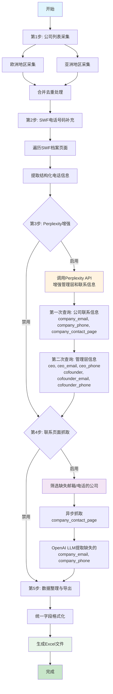

# 财富管理公司数据采集系统

## 项目概述

本项目是一个完整的财富管理公司数据采集、增强和导出系统，通过多源数据整合和AI智能增强，实现高质量的公司信息收集。

## 项目结构

```
refinco/
├── main.py                    # 主程序入口，包含完整的5步工作流
├── requirements.txt           # Python依赖包列表
├── spec.md                   # 项目说明文档
├── utils/                    # 工具模块目录
│   ├── get_company_list_from_swfinstitute.py    # SWF网站公司列表采集
│   ├── enhance_info_with_perplexity.py          # Perplexity AI信息增强
│   ├── openai_llm.py                            # OpenAI LLM接口
│   ├── enhance_info_with_page.py                # 联系页面抓取工具
│   └── swf_profile_scraper.py                   # SWF档案页面抓取
├── data/                     # 输出数据目录
│   └── wealth_managers_combined_*.xlsx          # 生成的Excel文件
└── README.md                 # 项目介绍
```

## 核心代码文件

### 1. **main.py** - 主程序
**功能**: 统一的工作流控制器，包含完整的数据处理流程
**主要组件**:
- `collect_companies_from_base_urls()`: 多地区公司数据采集
- `enhance_companies_with_swf_phone()`: SWF档案电话号码补充
- `enhance_companies_with_perplexity()`: Perplexity AI信息增强
- `enhance_companies_with_contact_pages()`: 联系页面智能抓取
- `write_companies_to_excel()`: Excel格式数据导出

### 2. **utils/** - 工具模块
**功能**: 专业化的数据处理工具集
- **get_company_list_from_swfinstitute.py**: 使用Azure OpenAI解析SWF网站HTML内容
- **enhance_info_with_perplexity.py**: 集成Perplexity API进行公司信息扩展
- **openai_llm.py**: OpenAI GPT模型接口封装
- **enhance_info_with_page.py**: 异步网页抓取和内容解析
- **swf_profile_scraper.py**: SWF公司档案页面结构化数据提取

## 核心逻辑流程

### 完整的5步数据处理工作流



### 数据处理逻辑详解

#### 第1步: 基础数据采集
- **输入**: SWF Institute区域URL列表
- **处理**: 
  - 多页面并发抓取（支持分页）
  - Azure OpenAI解析HTML结构
  - 公司名称去重算法
- **输出**: `(company_name, country, swf_url)` 基础三元组

#### 第2步: 结构化信息补充
- **输入**: 带SWF URL的公司列表
- **处理**:
  - BeautifulSoup解析档案页面表格结构
  - CSS选择器精确提取电话号码
  - 错误容忍和重试机制
- **输出**: 补充`company_phone`字段

#### 第3步: Perplexity AI智能增强 
- **输入**: 基础公司信息 `(company_name, country, swf_url, company_phone)`
- **处理**:
  - **第一次查询**: 获取公司联系信息
    - 查询: `company_email`, `company_phone`, `company_contact_page`
    - 补充公司官方联系方式和联系页面URL
  - **第二次查询**: 获取管理层信息  
    - 查询: `ceo`, `ceo_email`, `ceo_phone`, `cofounder`, `cofounder_email`, `cofounder_phone`
    - 提取CEO和联合创始人的详细联系信息
  - **🔥 关键配置**: `"search_context_size": "high"` - 确保获取更全面的搜索结果
  - **结构化输出**: 使用 `response_format` JSON Schema 强制结构化返回
  - Perplexity API实时查询，确保信息准确性
- **输出**: 增强9个字段的完整公司信息

#### 第4步: 联系页面智能抓取
- **输入**: 包含`company_contact_page`的公司数据
- **处理**:
  - **目标字段**: 补充可能缺失的 `company_email` 和 `company_phone`
  - **智能筛选**: 仅处理缺失邮箱或电话且有联系页面URL的公司
  - **异步抓取**: crawl4ai异步网页抓取联系页面内容
  - **AI解析**: OpenAI GPT-4理解网页内容并提取联系信息
  - **结构化输出**: JSON格式解析，精确提取邮箱和电话
  - **数据验证**: 过滤无效信息，保证数据质量
- **输出**: 补强后的公司联系信息（优先补充缺失字段）

#### 第5步: 数据标准化导出
- **输入**: 多源增强后的公司数据
- **处理**:
  - 字段标准化和空值处理
  - pandas DataFrame结构化
  - Excel格式优化输出
- **输出**: 时间戳命名的Excel文件

## 技术栈与核心库

### 核心框架
- **Python 3.9+**: 主要开发语言
- **AsyncIO**: 异步并发处理框架
- **Type Hints**: 完整的类型注解支持

### 数据处理库
- **pandas**: 结构化数据操作和Excel导出
- **openpyxl**: Excel文件读写引擎
- **requests**: HTTP请求处理
- **BeautifulSoup4**: HTML解析和数据提取

### AI与机器学习
- **OpenAI GPT-4**: 自然语言理解和信息提取
- **Perplexity API**: 实时信息查询和增强 
  - **🔥 重要**: `search_context_size: "high"` 必须设置为获取充分上下文
  - **结构化输出**: JSON Schema 强制格式化返回数据
- **Azure OpenAI**: 企业级AI服务集成

### 网页抓取技术
- **crawl4ai**: 现代异步网页抓取框架
- **aiohttp**: 异步HTTP客户端
- **Selenium**: 动态页面处理（备用方案）

### 开发工具与质量保证
- **logging**: 完整的日志记录系统
- **pathlib**: 现代文件路径处理
- **typing**: 静态类型检查支持
- **json**: 结构化数据解析

### 环境配置
```bash
# 必需依赖
pip install pandas openpyxl requests beautifulsoup4

# AI服务依赖  
pip install openai  # 需要OPENAI_API_KEY
# Perplexity API需要PERPLEXITY_API_KEY

# 网页抓取依赖
pip install crawl4ai aiohttp

# 开发依赖
pip install python-dotenv  # 环境变量管理
```

### API密钥配置
```bash
# 环境变量设置
export OPENAI_API_KEY="your-openai-key"
export PERPLEXITY_API_KEY="your-perplexity-key"  # 可选
export AZURE_OPENAI_ENDPOINT="your-azure-endpoint"  # 可选
```

## 运行方式

### 基础运行
```bash
python main.py
```

### 高级配置
可在`main()`函数中调整以下参数：
- `pages`: 每个地区抓取的页数（默认3页）
- `limit`: 处理公司数量限制（0表示无限制）
- `enhance_swf_phone`: 是否启用SWF电话补充
- `enhance_perplexity`: 是否启用Perplexity增强
- `enhance_contact`: 是否启用联系页面抓取

## 输出说明

### 数据字段（COMPOSITE_KEYS）
标准化的公司信息字段：
- `company_name`: 公司名称
- `country`: 国家/地区
- `company_contact_page`: 联系页面URL
- `company_email`: 公司邮箱
- `company_phone`: 公司电话
- `ceo`: CEO姓名
- `ceo_email`: CEO邮箱
- `ceo_phone`: CEO电话
- `cofounder`: 联合创始人
- `cofounder_email`: 联合创始人邮箱
- `cofounder_phone`: 联合创始人电话

### 文件输出
- **位置**: `data/wealth_managers_combined_YYYYMMDD_HHMMSS.xlsx`
- **格式**: Excel (.xlsx)
- **编码**: UTF-8
- **工作表**: Sheet1

## 扩展开发

### 新增地区采集
```python
base_urls = [
    "https://dev.swfinstitute.org/profiles/wealth-manager/europe",
    "https://dev.swfinstitute.org/profiles/wealth-manager/asia",
    "https://dev.swfinstitute.org/profiles/wealth-manager/americas"  # 新增
]
```

### 自定义字段定义
修改`utils/enhance_info_with_perplexity.py`中的`COMPOSITE_KEYS`常量

### 新增数据源
在`utils/`目录下创建新的数据源模块，参考现有模块结构